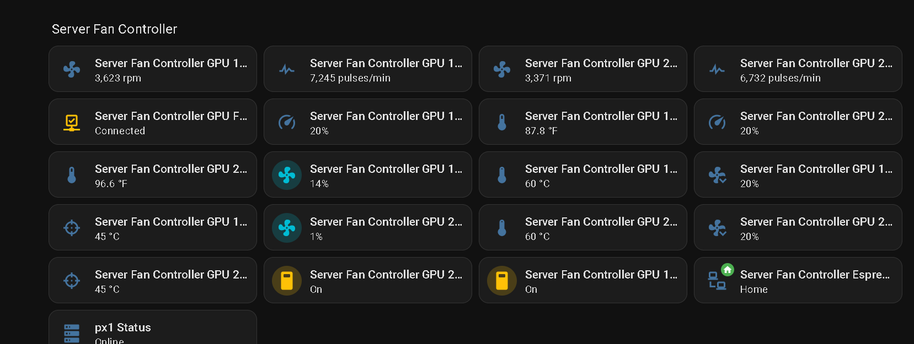
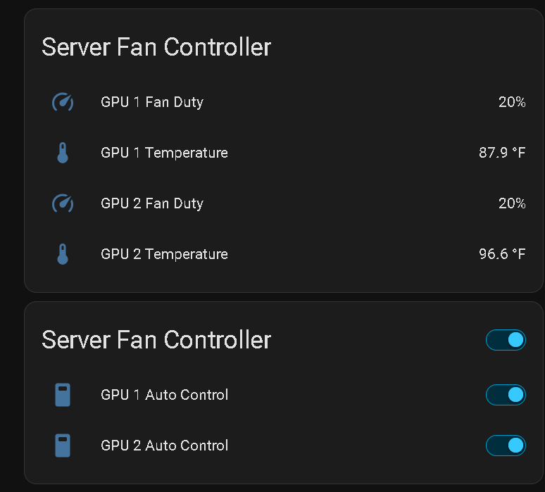
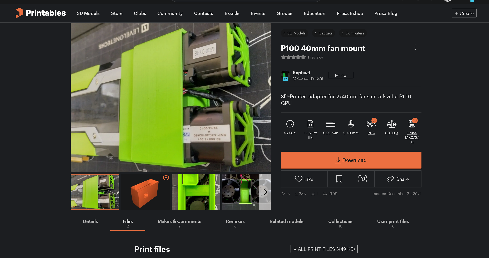

This code is setup for ESP Home to run on home assistant and can be vide coded to use as a standard ESP32 using IDE. 

This has its own webpage and then integrades into HAOS, and was programmed and setup on ESPhome plugin on HAOS

Here is the webpage:

The logs show in real time and can also be checked in ESPhome, supports OTA updates and programming once it is programmed over USB. 
The Dallas sensors are single pin addressed, so that will need to be set for each fan bank. An initial base program is done to setup the ESPhome and the first part of the code
that enables the one pin. Once its programmed you can pull the logs and find the addresses of the sensors and add that to the code plus your SSID, and password, and encryption. 

For the fans and powering the ESP32 I picked up this https://www.amazon.com/dp/B0B2L68WSZ?ref_=ppx_hzsearch_conn_dt_b_fed_asin_title_7&th=1 PCie to 6 fan output and a kit to feed the tach and PWM to the ESP32 https://www.amazon.com/dp/B0F4JM3B7K?ref_=ppx_hzsearch_conn_dt_b_fed_asin_title_12

The trick here is to only use one of the fan tachs from each fan pair, and run each PWM to each fan. So in the end the server fans per GPU will have a fan with 3 wires, and one with 4 wires going to it. 
For the fans I used Arctic 1400-15000 RPM PWM 4 wire server 4028 fans. These fans can be loud, that is why I made this controller. It also has the added benifit that if the ESP fails or locks up and there it a loss of PWM the fans will default to full speed. https://www.amazon.com/dp/B09SB9D7V2?ref_=ppx_hzsearch_conn_dt_b_fed_asin_title_17&th=1

For the GPU power I used this adapter https://www.amazon.com/dp/B0BM7HT56K?ref=ppx_yo2ov_dt_b_fed_asin_title&th=1 and this https://www.amazon.com/dp/B07HCYDK5K?ref=ppx_yo2ov_dt_b_fed_asin_title&th=1

For the ESP32 I used a standard ESP on a dev board https://www.amazon.com/dp/B0C8H6ZGRR?ref_=ppx_hzsearch_conn_dt_b_fed_asin_title_37&th=1 and standard dupont connector for all of the connection that allow Power, Ground, and signal wires, and a barrel connection to the ESP for power. I used the pin kit above to adapt one of the 12v fan connections to the 5.5x2.4mm barrel connections. The Dev board has an on board voltage regulator. I used PCB sticky mounts, and slightly drilled the dev board out and stuck them to the backplance side of the Dell below the power rail PCB. The Dallas sensor 4.7k ohm resistors are in the wiring. 

For the PWM and Tach signals I made a breadboard for them and 3D printed a case for it. I used this to add the dropping resistors and the capacitors for noise. 

The 3D printed fan mount I used for the P100 is located here. https://www.printables.com/model/100708-p100-40mm-fan-mount/files

The designer used quad fans but they are overkill with the controller I made. It allows you to set the fan ramping PID loop to whatever you need to keep them cool, I have run them very hard and since setting the PID loop they never get over 55C. 