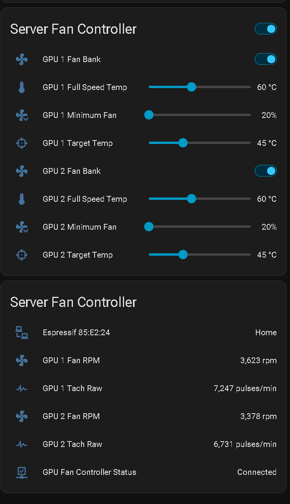
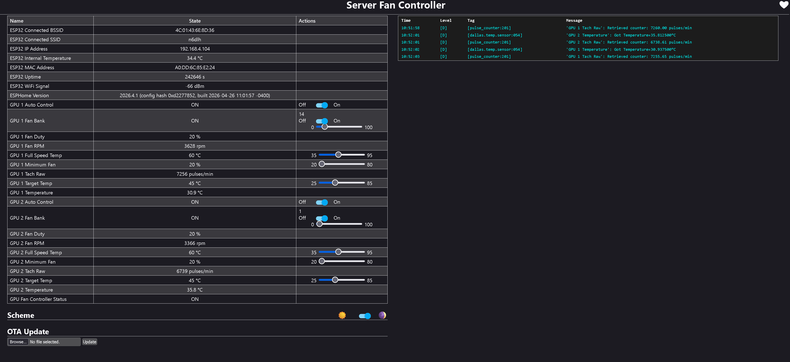

This code is setup for ESP Home to run on home assistant and can be vide coded to use as a standard ESP32 using IDE. 

This has its own webpage and then integrades into HAOS, and was programmed and setup on ESPhome plugin on HAOS

Here is the webpage:

The logs show in real time and can also be checked in ESPhome, supports OTA updates and programming once it is programmed over USB. 
The Dallas sensors are single pin addressed, so that will need to be set for each fan bank. An initial base program is done to setup the ESPhome and the first part of the code
that enables the one pin. Once its programmed you can pull the logs and find the addresses of the sensors and add that to the code plus your SSID, and password, and encryption. 