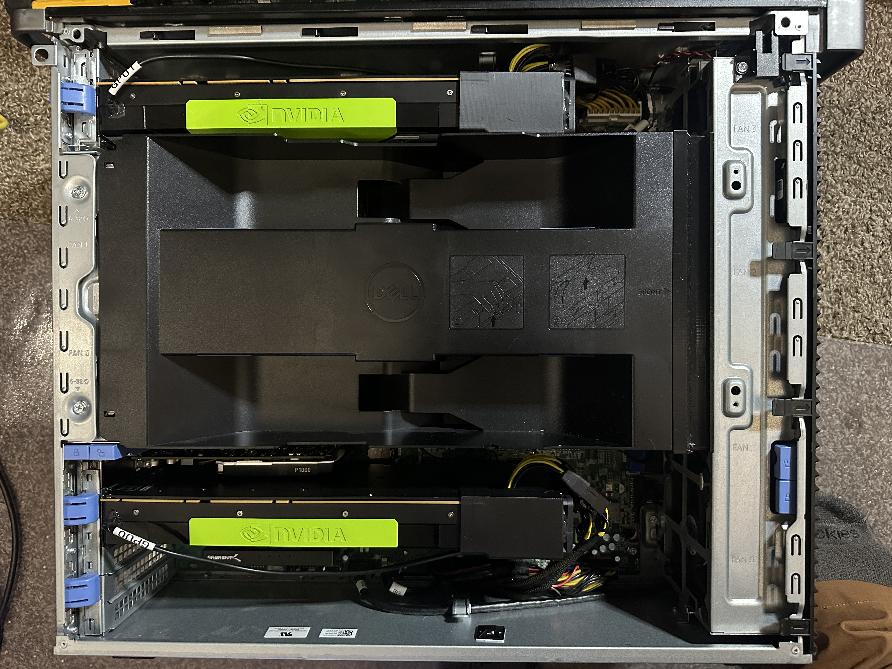
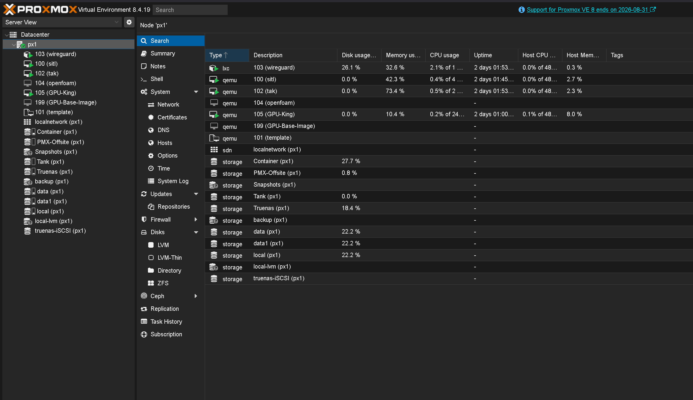
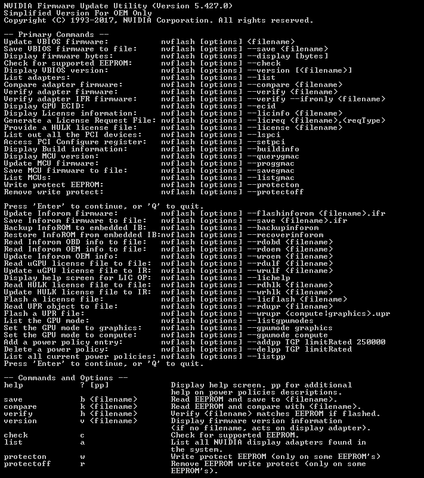

# 7920-GPU-Server-Conversion

This is the collection of materials and how to convert the Dell Precision T7920 to a server to run not only multiple GPUs, but to run older and cheaper Nvidia Data Center GPU for use of doing local LLM, Agentic Machine Learning, hosting, CFD analysis using GPUs. 

This will concentrate on the things I had to do, build, and modify to allow me to use these server Nvidia P100 GPUs in a work station that was not designed for them. The changes to the card to enable the Dell Bios to see them, cooling solutions that is automated and tuneable, the mods to the computer to get them to fit and have the correct front to back airflow. 

I started this wit a Base Dell Precision T7920 workstation that had a single Xeon Bronze CPU and 8GB of ram. To Dual Xeon 6136 Gold proccessors with 64gb of ram and gorwing. Running Proxmox on an NVME boot drive with 2x Nvidia P100 GPUs with 16GB of Vram each, and a 3rd card going in. 

The Basic Overview is I modified the internal air deflector to keep the CPU, Ram, and Vram air guide with a 3d printed part, used 2 4020 Arctic server 40mm fans per GPU with an 3d printed fan duct. Dallas temp sensors, and an ESP32 to monitor the temps, and control the fan PWM and Tach signals using ESP Home and home assistant. The power for the fans and ESP32 use a Dell PCIE single plug power cable that came with the workstation. 

Powering the GPU I purchased custom Nvidia P100 8 pin to dual 8pin PCIe power plugs, and custom Dell 10 pin power rail to to dual 8 pin PCIe plugs to split the current accross 2 wires instead on just 1. 

The 7920 has 4 power rail 10 pin plugs capable of 300w each in power delivery, a 1450w power supply, and can take Dual Xeon Gen 1 & Gen 2 processors and up to 3Tb of EEC DDR4 ram. 

I am running Proxmox on the machine,and passing the Nvidia GPU to a VM. In the VM I have ollama.cpp running with Open Webui and Hermes agent running. I also have the Hermes Telegram plugin running 

This is an NVTOP running qwen2.5-14b queried in Open Web UI and loading the model to memory and answering, I have it set to unload the model when it has not been queried in a minute, this is able to spread the model over the Vram of multiple GPUs and works very well. 

One of the biggest challenges to getting the Dell Bios to see the cards at all and getting it to boot. Throwing the card in and powering on will not work. The Bar address of the PCIE on these cards are huge. For the dell you have to enable read addresses over 4GB on the PCIE and shut off some of the Intel PCIE setting. Also you will need a windows computer that can boot with the cards and see them. Download [NVflash from GPUZ](https://www.techpowerup.com/download/nvidia-nvflash/) and make sure that the card is being seen by the computer. Unzip the folder and then open a command prompt as Adminastrater. Move into the folder where the NVflash64 file is and backup the flash. When in command prompt run nvflash64 --save backupbios.rom

Once that is done run the command

nvflash64 --listgpumodes

It should come back showing Compute if that is the case you will need to set it to display mode, this only changes the how the bios sees the card, it does not limit the ability to use the vram, it will set the bar size to 256mb for the boot portion, once the driver loads the card will be able to be fully utilized. 

run this

nvflash64 --gpumode graphics 

If that completes without errors you can run the list mode again to validate the graphics is enabled. 

The next challenge is keeping the Proxmox driver from loading so you can pass the gpu through to the VM. I will touch on that in the future, I have to go through setting that up again, but there are videos on how to set it up. Next is in the VM you have to download the Nvidia 535 driver, tools, adn Cuda to get it all working.