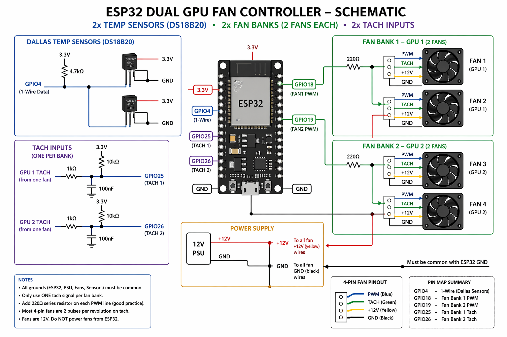

| Function        | GPIO   |
| --------------- | ------ |
| 1-Wire (Dallas) | GPIO4  |
| Fan Bank 1 PWM  | GPIO18 |
| Fan Bank 2 PWM  | GPIO19 |
| Fan Bank 1 Tach | GPIO25 |
| Fan Bank 2 Tach | GPIO26 |

Components:
2x DS18B20
1x 4.7kΩ resistor
Wiring:
ESP32 GPIO4 ─────┬──────── Sensor 1 Data
                 └──────── Sensor 2 Data

GPIO4 ──[4.7kΩ]── 3.3V

All sensors:
- VCC → 3.3V
- GND → GND

| Wire   | Function |
| ------ | -------- |
| Black  | GND      |
| Yellow | +12V     |
| Green  | Tach     |
| Blue   | PWM      |

12V PSU (+) ────── all fan yellow wires
12V PSU (GND) ──── ESP32 GND + fan grounds

GPIO18 ─────┬──── Fan1 PWM (blue)
            └──── Fan2 PWM (blue)

GPIO19 ─────┬──── Fan3 PWM (blue)
            └──── Fan4 PWM (blue)  
Fan1 Tach (green) ─── GPIO25

Fan2 Tach (green) ─── GPIO26

GPIO25 ──[10kΩ]── 3.3V
GPIO26 ──[10kΩ]── 3.3V

Tach line ──[1kΩ]── GPIO
               |
              100nF
               |
              GND

